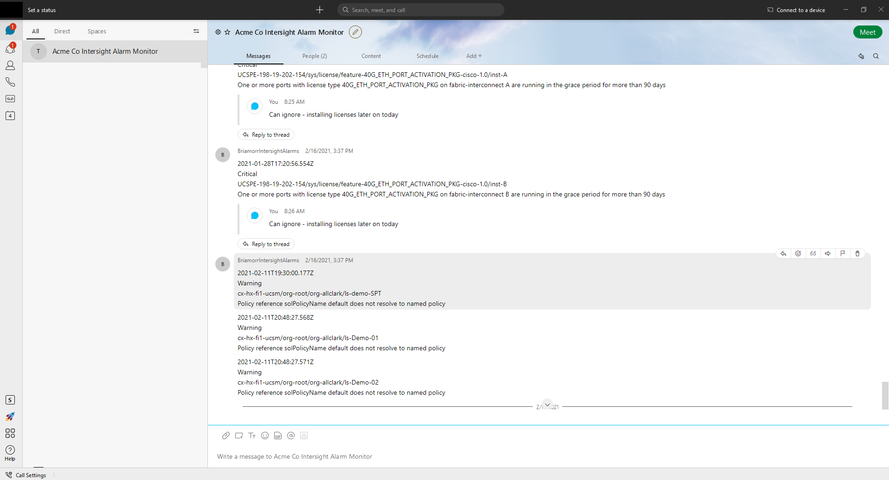

# Intersight Alarm Monitor Example
AWS Lambda based Python 3.8 script to check Intersight for alarms generated within the past 15 minutes and post to a Webex room.

</img>

Pre-requisites:
1. Amazon AWS Account w/Lambda and Event Bridge Features (https://aws.amazon.com/)

[As of 3/2021 the free tier of Lambda allows for 1M free requests per month and 400,000 GB-seconds of compute time per month and $1 per month for a million Event Bridge events]

2. Webex Bot w/API Keys (https://developer.webex.com/docs/bots)
3. Intersight Account w/API Keys (https://intersight.com/help/features#api_keys)
4. Linux machine with Python 3.8 installed 
 
Instructions:
1. Replace contents of SecretKey.txt with Interight API Private Key
2. Replace contents of .env with Intersight API Key, Webex Room ID, Webex Bot Token
3. Create AWS Lambda package from root of project directory:

        sudo pip3 install --target ./package cryptography requests python-dotenv

        cd package/

        zip -r ../my-deployment-package.zip .

        cd ..

        zip -g my-deployment-package.zip *.py

        zip -g my-deployment-package.zip *.txt

        zip -g my-deployment-package.zip *.env

4. Create AWS Lambda Function using Python 3.8
5. Upload my-deployment-package.zip to Lambda Function
6. Set timeout to 8 seconds on AWS Lambda Function
7. Create AWS Event Bridge to run Lambda Function at a fixed interval every 15 minutes
